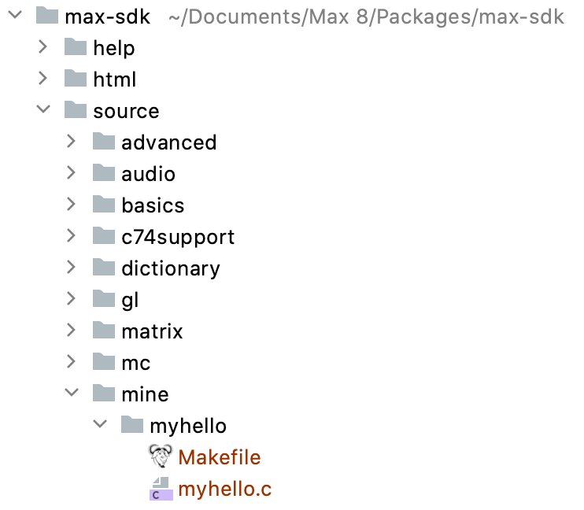
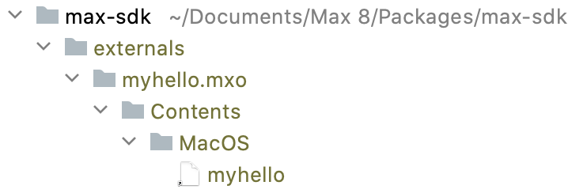

# Max macOS Makefile

A Makefile for building [Max](https://cycling74.com/products/max) externals on the command line.

## Prerequisites

You will need Xcode installed.

## Instructions

### Get the Max SDK

Get a copy of the [Max Software Development Kit](https://cycling74.com/downloads/sdk) and put it in Max's packages
folder. For example, drag the extracted `max-sdk-8.0.3` folder into your `Documents/Max 8/Packages` folder.

### Create directories for your external code

Next, create a personal directory for your code in the `source` folder in the Max SDK. The name is not important.
Inside that newly created directory, create a directory for each external, and copy the Makefile into each external
directory. For example:



### Edit the Makefile for your external

If you only have a single `.c` file, just set the name of your external by editing the `name` variable, which is set in
the first line of the `Makefile`.

### Build your external

Open a terminal and from inside the directory you created for your external (where the `Makefile` is located), run:

```
make
```

This will build the external. Now you need to put it somewhere where Max can find it. In the same directory, run:

```
make install
```

This will copy the external (which ends with a `.mxo` extension) into the `externals` directory at the top-level of
the Max SDK directory:



At this point you will need to quit and restart Max to pick up the new external.

### Cleaning up and uninstalling your external

To delete all of the build artifacts from your external's source directory:

```
make clean
```  

To delete the files that `make install` copied into the `externals` directory:

```
make uninstall
```

## Limitations

### Rigid directory structure

The `Makefile` depends on the directory structure above. Specifically, an individual external *must* be located in a
subdirectory (the `mine` directory in the image above) of the `source` directory of the main Max SDK directory.

### Only works with a single source code file

You will have to edit the `sources` and `objects` variables in the `Makefile` if you want to use more than one source
code file.

### Code signing

You may not be able to distribute compiled externals to other users due to code signing. See:

[Using Unsigned Max Externals on Mac OS 10.15 (Catalina)](https://cycling74.com/articles/using-unsigned-max-externals-on-mac-os-10-15-catalina)
